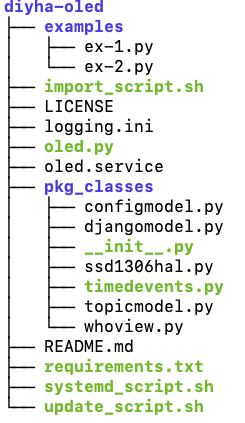

# diyha-oled
Information display containing server information and location specific environment data.
## Description
Adaftruit's OLED software running SSD1306 OLED device. The OLED display is used as a simple dynamic display controlled by MQTT subscribed messages. The Python application responds to specific information based on application topics, e.g. MQTT Broker subscribe/publish. This application is one of several general classes in my *do it yourself home automation system* (**DIYHA**). Each python DIYHA application is hosted on a Raspberry Pi server and will respond to a variety of subscribed topic and report on their status or application specific test data. 

[](https://opensource.org/licenses/MIT)

[](https://svgshare.com/i/Zhy.svg)

> Live demo [_here_](https://www.example.com). <!-- If you have the project hosted somewhere, include the link here. -->

## Table of Contents
* [General Info](#general-information)
* [Technologies Used](#technologies-used)
* [Features](#features)
* [Screenshots](#screenshots)
* [Architecture](#architecture)
* [Setup](#setup)
* [Usage](#usage)
* [Project Status](#project-status)
* [Room for Improvement](#room-for-improvement)
* [Acknowledgements](#acknowledgements)
* [Contact](#contact)
<!-- * [License](#license) -->

## General Information
- Provide general information about your project here.
  - This is one of several Python processes used in my home automation system (**DIYHA**). I've used OOP, MVC, and MTV concepts in my DIYHA system. 
- What problem does it (intend to) solve?
  - I wanted to isolate the status and diganostic messages into a single class. The main python application subscribes to a **diy/system/who** topic and responds by turning on or off status updates.
- What is the purpose of your project?
  - My home automation system contains environment sensors, motion sensors, LED clocks, light switches, emergency sirens, a django web server, interfaces to Adafruit.io and a mosquitto MQTT broker.
- Why did you undertake it?
  - This was a fun project to learn about python, Raspberry Pi, Arduino processors, hardware and more.
<!-- You don't have to answer all the questions - just the ones relevant to your project. -->

## Technologies Used
- python=3.7.3
- adafruit-circuitpython-ssd1306=2.12.4
- Adafruit-Blinka=7.1.0
- paho-mqt=1.6.1

## Features
List the ready features here:
- Handles the basic **diy/system/who** function
- Reports on status and diagnostic information on paged flipped OLED displays.
- Code passes pylint with a score of 10.0

## Screenshots
Not applicable.
<!-- -->
<!-- If you have screenshots you'd like to share, include them here. -->

## Architecture

<!-- If you have screenshots you'd like to share, include them here. -->

## Setup
What are the project requirements/dependencies? Where are they listed? A requirements.txt or a Pipfile.lock file perhaps? Where is it located?
- git clone the repository 
```
git clone https://github.com/parttimehacker/diyha-oled.git
cd diyha-oled
```
<div align="left">
     
</div>

- install dependencies
```
sudo pip3 install -r requirements.txt
```

## Usage
You need to decide whether you want to manually run the application or have it started as part of the boot process. I recommend making a **Raspbian OS systemd service**, so the application starts when rebooted or controled by **systemctl** commands. The **systemd_script.sh** creates a admin directory in **/usr/local directory**. The application files are then copied to this new directory. The application will also require a log file in **/var/log directory** called admin.log
### Manual or Command Prompt
To manually run the application enter the following command (sudo may be required on your system)
```
sudo python3 oled.py --mq MQTTBROKERSERVER --lt LOCATIONTOPIC -ws DJANGOWEBSERVER
```
- MQTTBROKERSERVER is the host name or IP address of MQTT broker. I use the Open Source Mosquitto broker and bridge.
- LOCATIONTOPIC is the MQTT topic name for the location of the server. 
- DJANGOWEBSERVERis the host name or IP address of RESTful API web server. I use django infrastructure
### Raspbian systemd Service
First edit the **clock systemd service** and replace the MQTT broker and room values with their host names or IP addresse. A systemd install script will move files and enable the applicaiton via **systemctl** commands.
- Run the script and provide the application name **admin** to setup systemd (the script uses a file name argument to create the service). 
```
vi oled.service
./systemd_script.sh oled
```
This script also adds four aliases to the **.bash_aliases** in your home directory for convenience.
```
sudo systemctl start oled
sudo systemctl stop oled
sudo systemctl restart oled
sudo systemctl -l status oled
```
- You will need to login or reload the **.bashrc** script to enable the alias entries. For example:
```
cd
source .bashrc
```
### MQTT Topics and Messages
The application subscribes to multiple MQTT topics and publishes initialization messages. Three are handled locally and the rest are sent to the web server's API for processing.
- Two topics **diy/system/fire** and **diy/system/panic** are special cases and also email alerts
- The **diy/system/who** sends local server information to the web server's API. 
- The reset of the MQTT messages are translated to HTTP messages to the web server's API for processing.
- System message are initialized at startup and legacy messages are sent to a older running applications.

## Implementation Status


## Room for Improvement
Include areas you believe need improvement / could be improved. Also add TODOs for future development.

Room for improvement:
- Further refactoring to more generalize the class

To do:
- Integrate into other DIYHA applications and repositories
- Develop a new installation process for seperate repositories


## Acknowledgements
Give credit here.
- This project was inspired by...
- This project was based on [this tutorial](https://www.example.com).
- Many thanks to...


## Contact
Created by [@parttimehacker](http://parttimehacker.io/) - feel free to contact me!
### Repository Stats

### Repository Languages

### HITS


<!-- Optional -->
<!-- ## License -->
<!-- This project is open source and available under the [... License](). -->

<!-- You don't have to include all sections - just the one's relevant to your project -->
